# Custodial Transfer Smart Contract

A simple and efficient escrow smart contract for Cardano that enables secure asset transfers between parties through a trusted custodian. This contract mimics real-world shipping and logistics scenarios where a carrier holds assets until delivery conditions are met.

## 🔍 Overview

The custodial transfer contract facilitates secure asset transfers between three parties:
- **User A / Sender (Party A)**: Deposits assets into escrow
- **User B / Final Receiver (Party B)**: Intended recipient of the assets  
- **Entity C / Custodian (Party C)**: Trusted third party who validates and facilitates delivery

## 📊 Contract Flow

```mermaid
graph TD
    A[User A deposits assets<br/>Any amount of ADA + tokens] --> B[Contract UTXO created<br/>with Datum]
    
    B --> C{What happens next?}
    
    C -->|Withdraw<br/>Signed by: User A| D[ALL value → User A<br/>Contract ENDS]
    
    C -->|Deliver<br/>Signed by: Entity C only| E[ALL value → User B<br/>Contract ENDS]
    
    C -->|Refuse Delivery<br/>Signed by: User B| F[ALL value → User A<br/>Contract ENDS]
    
    G[Datum Structure<br/>sender: User A KeyHash<br/>receiver: User B KeyHash<br/>custodian: Entity C KeyHash] --> B
    
    style A fill:#e1f5fe
    style D fill:#e8f5e8
    style E fill:#e8f5e8
    style F fill:#e8f5e8
    style B fill:#fff3e0
    style G fill:#f3e5f5
```



## 🏗️ Data Structures

### Datum
The contract state stored in the UTXO:

```aiken
pub type Datum {
  sender: VerificationKeyHash,      // User A who deposits
  receiver: VerificationKeyHash,    // User B who receives
  custodian: VerificationKeyHash,   // Entity C who validates/facilitates
}
```

### Redeemer
The actions that can be performed:

```aiken
pub type Redeemer {
  Withdraw,  // User A reclaims before delivery
  Deliver,   // Entity C facilitates delivery to User B
  Return,    // User B refuses delivery, returns to User A
}
```

## ⚡ Operations

### 1. Deposit (Off-chain)
- **Who**: User A (Sender)
- **Action**: Send any assets (ADA + tokens) to the contract address
- **Result**: Creates a UTXO with the deposit datum
- **Signature**: User A only

### 2. Withdraw
- **Who**: User A (Sender)
- **When**: Before delivery occurs
- **Action**: Reclaim all deposited assets
- **Result**: All assets returned to User A, contract ends
- **Signature**: User A only

### 3. Deliver
- **Who**: Entity C (Custodian)
- **When**: Custodian confirms successful delivery
- **Action**: Transfer all assets to User B (receiver)
- **Result**: All assets go to User B, contract ends
- **Signature**: Entity C only (custodian confirms delivery)

### 4. Return (Refuse Delivery)
- **Who**: User B (Receiver)
- **When**: User B refuses the delivery
- **Action**: Send all assets back to User A
- **Result**: All assets returned to User A, contract ends
- **Signature**: User B only (receiver refuses)

## 🎯 Key Features

### ✅ Advantages
- **Simple Design**: Minimal datum with only essential party information
- **Flexible Assets**: Supports any combination of ADA and native tokens
- **Complete Transfer**: Entire UTXO value transferred (no partial transfers)
- **Clean Termination**: Contract ends after any operation (no lingering UTxOs)
- **Gas Efficient**: Minimal on-chain state and computation

### 🔒 Security Features
- **Signature Verification**: All operations require appropriate signatures
- **Complete Value Transfer**: Ensures all assets are properly transferred
- **No Continuing Outputs**: Prevents creation of useless UTxOs
- **Atomic Operations**: All transfers happen in single transactions

## 🔧 Building and Testing

### Build the Contract
```bash
cd custodial-transfer
aiken build
```

### Run Tests
```bash
aiken check
```

### Format Code
```bash
aiken fmt
```

## 📝 Usage Examples

### Example 1: Digital Asset Sale
1. **Seller deposits** 1000 TokenA + 5 ADA into escrow
2. **Buyer confirms** delivery with shipping company approval
3. **All assets transferred** to buyer automatically

### Example 2: Freelance Payment
1. **Client deposits** 50 ADA as payment
2. **Freelancer delivers** work, shipping company validates
3. **Payment released** to freelancer

### Example 3: Withdrawal Before Delivery
1. **Sender deposits** assets
2. **Sender changes mind** before delivery
3. **Sender withdraws** all assets, contract ends

## 🏛️ Contract Architecture

The contract follows a simple but robust design:

- **Stateless**: No complex state tracking needed
- **Value-focused**: Works with entire UTXO values
- **Party-centric**: Clear roles for all three parties
- **End-to-end**: Contract lifecycle from deposit to completion

## 🛠️ Integration

The contract can be integrated with:
- **Wallets**: For signing transactions
- **DApps**: For user interfaces
- **APIs**: For automated escrow services

## 📄 License

Licensed under the Apache License, Version 2.0.

## 🤝 Contributing

Contributions are welcome! Please ensure all tests pass and follow the existing code style.

---

*This contract provides a foundation for secure, efficient asset transfers on Cardano. Its simplicity makes it both efficient and easy to understand, while maintaining strong security guarantees.*
