# Escrow Services Smart Contract

A simple yet powerful escrow smart contract for Cardano that enables secure asset transfers with time-based and key-based unlock conditions. This contract extends beyond basic custodial transfers to provide configurable escrow services suitable for various use cases.

## 🔍 Overview

The escrow services contract facilitates secure asset transfers between parties with flexible unlock conditions:
- **Depositor**: Party who deposits assets into escrow
- **Beneficiary**: Intended recipient of the assets  
- **Authorized Keys**: Keys that can authorize releases/refunds
- **Configurable Fees**: Optional service fees (0% to any percentage)

## 📊 Contract Flow

```mermaid
graph TD
    A[Depositor deposits assets<br/>Any amount of ADA + tokens] --> B[Contract UTXO created<br/>with EscrowDatum]
    
    B --> C{What happens next?}
    
    C -->|Release<br/>Key-based OR Time-based| D[Value → Beneficiary<br/>Fees → Fee Recipient<br/>Contract ENDS]
    
    C -->|Refund<br/>Key-based OR Time-expired| E[ALL value → Depositor<br/>Contract ENDS]
    
    C -->|Cancel<br/>Depositor only, before deadline| F[ALL value → Depositor<br/>Contract ENDS]
    
    G[EscrowDatum Structure<br/>depositor: KeyHash<br/>beneficiary: KeyHash<br/>deadline: Optional timestamp<br/>required_signatures: Int<br/>authorized_keys: List KeyHash<br/>fee_config: FeeConfig] --> B
    
    style A fill:#e1f5fe
    style D fill:#e8f5e8
    style E fill:#e8f5e8
    style F fill:#e8f5e8
    style B fill:#fff3e0
    style G fill:#f3e5f5
```



## 🏗️ Data Structures

### EscrowDatum
The contract state stored in the UTXO:

```aiken
pub type EscrowDatum {
  // Core parties
  depositor: VerificationKeyHash,
  beneficiary: VerificationKeyHash,
  
  // Time constraints (grant requirement)
  deadline: Option<Int>,  // POSIX timestamp (milliseconds) for auto-release
  
  // Key-based conditions (grant requirement)
  required_signatures: Int,         // 1 or 2 for simple multi-sig
  authorized_keys: List<VerificationKeyHash>,
  
  // Fee configuration (configurable, can be 0)
  fee_config: FeeConfig,
}

pub type FeeConfig {
  fee_percentage: Int,              // Basis points (0-10000, where 100 = 1%)
  fee_recipient: Option<VerificationKeyHash>,  // None = no fees
}
```

### EscrowRedeemer
The actions that can be performed:

```aiken
pub type EscrowRedeemer {
  Release,  // Release to beneficiary (key-based or time-based)
  Refund,   // Refund to depositor (key-based or time-expired)
  Cancel,   // Cancel by depositor before deadline
}
```

## ⚡ Operations

### 1. Deposit (Off-chain)
- **Who**: Depositor
- **Action**: Send any assets (ADA + tokens) to the contract address
- **Result**: Creates a UTXO with the escrow datum
- **Requirements**: Depositor signature only

### 2. Release
- **Who**: Anyone with proper authorization
- **When**: Either key-based authorization OR after deadline
- **Conditions**: 
  - **Key-based**: Required number of authorized signatures present
  - **Time-based**: Current time past deadline (automatic unlock)
- **Action**: Transfer assets to beneficiary (minus fees)
- **Result**: Assets go to beneficiary, fees to fee recipient, contract ends
- **Fees**: Configurable percentage deducted from total value

### 3. Refund
- **Who**: Anyone with proper authorization
- **When**: Either key-based authorization OR after deadline expiry
- **Conditions**:
  - **Key-based**: Required number of authorized signatures present
  - **Time-based**: Time expired past deadline
- **Action**: Return all assets to depositor
- **Result**: All assets returned to depositor, contract ends
- **Fees**: No fees charged on refunds

### 4. Cancel
- **Who**: Depositor only
- **When**: Before deadline (if deadline exists)
- **Action**: Cancel escrow and return all assets
- **Result**: All assets returned to depositor, contract ends
- **Fees**: No fees charged on cancellation

> Detailed CLI walkthroughs live in [`demo/SCENARIOS.md`](demo/SCENARIOS.md) and the accompanying [`demo/README.md`](demo/README.md). They reference the rules in this section so the information stays in sync.

### Validity & Fee Rules
- Deadlines are stored in POSIX **milliseconds**. Off-chain builders must convert to milliseconds before calling wallet APIs such as `validFrom`/`validTo`.
- **Time-based release/refund** transactions must set `validFrom` at or after the datum deadline so the validator can prove that the deadline has passed without signatures.
- **Depositor cancel** transactions must set `validTo` strictly before the datum deadline. This proves the request happened in time and prevents reuse of the cancel redeemer after expiry.
- **Refund** and **cancel** flows never apply fees. The entire script balance returns to the depositor even if the datum configures a fee percentage.
- **Release** is the only path that deducts fees, and it requires a fee recipient output whenever the computed fee is non-zero.

## 🎯 Key Features

### ✅ Grant Requirements Met
- **Time-based unlock**: Assets automatically unlock after deadline
- **Key-based conditions**: Multi-signature authorization (1-of-N, 2-of-N, etc.)
- **User withdrawal**: Beneficiary can withdraw when conditions met
- **Configurable fees**: 0% to any percentage service fees
- **Clean termination**: Contract ends after any operation

### 🔒 Security Features
- **Signature verification**: All operations require appropriate signatures
- **Time validation**: Proper deadline enforcement (production ready)
- **Complete value transfer**: Ensures all assets are properly transferred
- **No continuing outputs**: Prevents creation of useless UTxOs
- **Atomic operations**: All transfers happen in single transactions
- **Fee protection**: Transparent and predictable fee calculations

### 🔧 Extensibility Features
- **Modular design**: Easy to add oracle-based conditions
- **Pluggable fees**: Configurable fee structures
- **Clean interfaces**: Ready for future enhancements

## 🎯 Use Cases & Demo Scenarios

### 1. Time-Lock Escrow
- **Setup**: Depositor locks 10 ADA for 1 hour
- **Unlock**: Beneficiary can withdraw after 1 hour automatically
- **Demo**: Perfect for demonstrating time-based unlock

### 2. Multi-Signature Escrow  
- **Setup**: Depositor locks assets, requires 2-of-3 signatures to release
- **Unlock**: Any 2 of the 3 authorized keys can release funds
- **Demo**: Shows key-based authorization flexibility

### 3. Service Payment Escrow
- **Setup**: Client deposits payment with 7-day deadline
- **Unlock**: Service provider can withdraw, or auto-refund after deadline
- **Demo**: Real-world freelance/service payment scenario

### 4. Fee-Based Escrow Service
- **Setup**: Escrow service charges 20% fee for facilitation (keeps fee output above min-ADA)
- **Unlock**: 80% goes to beneficiary, 20% to service provider
- **Demo**: Shows configurable fee functionality

🚀 **CLI demonstration:** `demo/deploy-cli.js` executes all four scenarios back-to-back using 5 ADA per escrow and inserts a 45-second pause after each transaction so Blockfrost can index the new UTxOs.

## 🔧 Building and Testing

### Prerequisites
- Aiken v1.1.17 or later
- Node.js v18+ and pnpm (for demo)
- Blockfrost API key (for real transactions)

### Build the Contract
```bash
cd escrow-services
aiken build
```

### Run Tests
```bash
aiken check
```

The test suite includes:

#### Property-Based Tests (Fuzzing)
- **Key-Based Release**: Verifies successful release when authorized signatures are present (`test_key_based_release_property`).
- **Depositor Refund**: Verifies depositor can successfully refund assets (`test_depositor_refund_property`).
- **Depositor Cancel**: Verifies depositor can successfully cancel before the deadline (`test_depositor_cancel_property`).
- **Unauthorized Release**: Ensures release fails if required signatures are missing (`test_unauthorized_release_fails_property`).
- **Unauthorized Cancel**: Ensures cancellation fails if attempted by anyone other than the depositor (`test_unauthorized_cancel_fails_property`).

#### Unit Tests
- **Simple Release**: Validates basic release flow with fixed test vectors (`test_simple_release_success`).
- **Simple Cancel**: Validates basic cancellation flow with fixed test vectors (`test_simple_cancel_success`).

#### Edge Case Tests
- **Empty Outputs**: specific check to ensure validation fails if funds are burnt or not output (`test_empty_outputs_fails`).
- **Continuing Outputs**: Verifies that the contract correctly prevents "continuing outputs" (sending funds back to the script), enforcing contract termination (`test_continuing_output_fails`).

### Format Code
```bash
aiken fmt
```

### Run Demo

#### 1. Get Blockfrost API Key
1. Go to [https://blockfrost.io/](https://blockfrost.io/)
2. Create a free account
3. Create a new project for **Preview** network
4. Copy your API key

#### 2. Setup Environment
```bash
cd demo
pnpm install

# Copy environment template
cp env.template .env

# Edit .env file and replace 'preview_your_blockfrost_key_here' with your actual API key
nano .env
```

#### 3. Run CLI Demo
```bash
pnpm start
# or
node deploy-cli.js
```

The CLI executes every escrow scenario sequentially and pauses for 45 seconds after each transaction so Blockfrost has time to index the results.

## 📝 Usage Examples

### Example 1: Simple Time-Lock
```javascript
// Datum for 1-hour time lock
const datum = {
  depositor: "addr1...",
  beneficiary: "addr2...", 
  deadline: Date.now() + 3600000, // 1 hour from now
  required_signatures: 1,
  authorized_keys: ["beneficiary_key"],
  fee_config: {
    fee_percentage: 0, // No fees
    fee_recipient: null
  }
}
```
